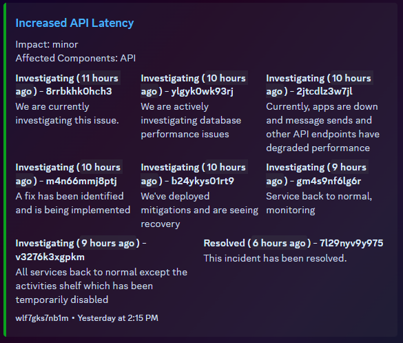

# Discord Status Webhook

## Introduction

This project is a simple discord webhook that sends an embed whenever Discord is
having issues via the [Discord API Status page](https://discordstatus.com/). Under
the hood, it uses the `discord.py` library to send the webhook.

The embeds are based on @Leannart's
[Discord API Status Webhook](https://github.com/Laennart/discord-api-status-webhook/tree/main)
project, but are more modifiable via the `config.py` file.



## Installation and Usage

1. Install dependencies

2. Clone the repository

```bash
git clone https://github.com/fatboychummy/Discord-Status-Webhook.git
```

3. Edit the `config.py` file to your liking. The only required field is at the
  very top of the file -- the webhook url.

4. To run the script, simply run `python3 main.py` in the root directory of the
  project.


### Creating and linking your Webhook

To create a webhook, you must have the `MANAGE_WEBHOOKS` permission in the
server you want to create the webhook in. To create a webhook, follow these
steps:

1. Right click on the channel you want the webhook to be in and click
  `Edit Channel`.

2. Click on the `Integrations` tab.

3. Click on the `Create Webhook` button. If a webhook already exists, you'll
  need to click `View Webhooks` and then `New Webhook`.

4. Copy the webhook url by selecting your webhook in the list after it has been
  created, then clicking `Copy Webhook URL`.

5. Paste the webhook url into the appropriate location in the `config.py` file.


### Dependencies

This was built on Python 3.11, but should work on older versions of Python 3.
I'm not a python addict, however, so I can't say exactly which versions will
work and which don't.

The following packages are required:

- discord.py
- aiohttp
- requests
- python-dateutil

```bash
pip install -U python-dateutil discord.py requests aiohttp
```